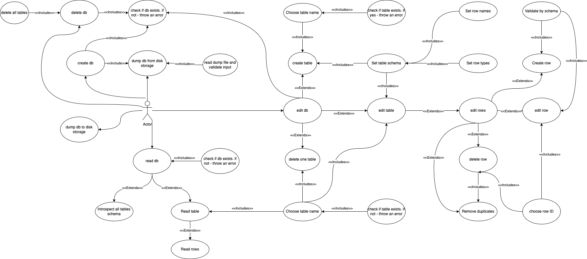

# Architecture

The design of `frog-db` is modular:

- `Database` object acts as a black box with only `execute` method exposed
- `Image` can be uploaded via usage of `Image solidifier` (which is not realized yet) and save link to image
- `Database` configuration processed via env variables defined in [config.go](https://github.com/ssyrota/frog-db/blob/main/src/core/db/config.go)

## Use-case diagram

