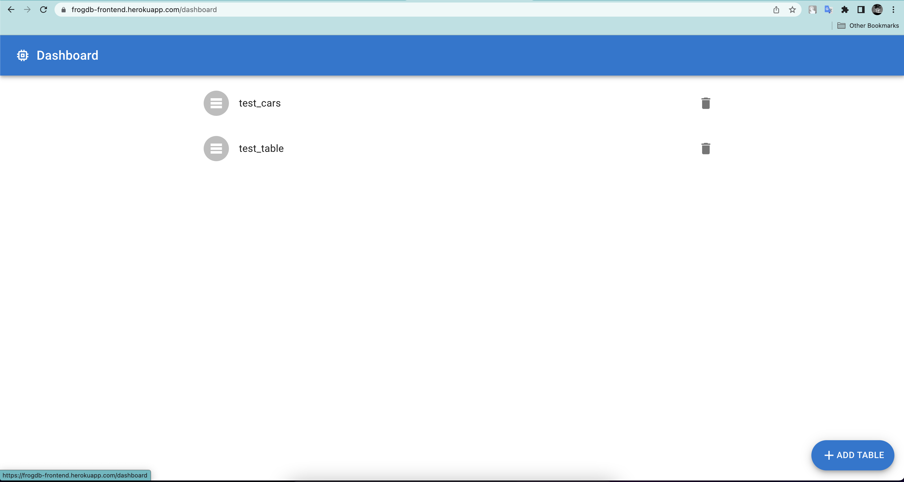
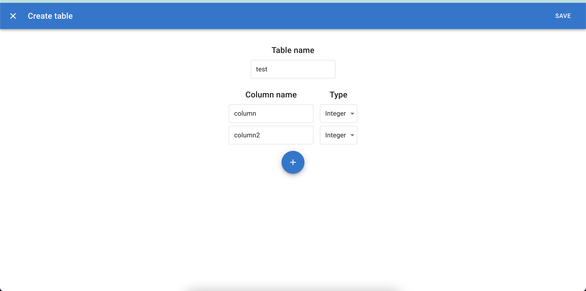
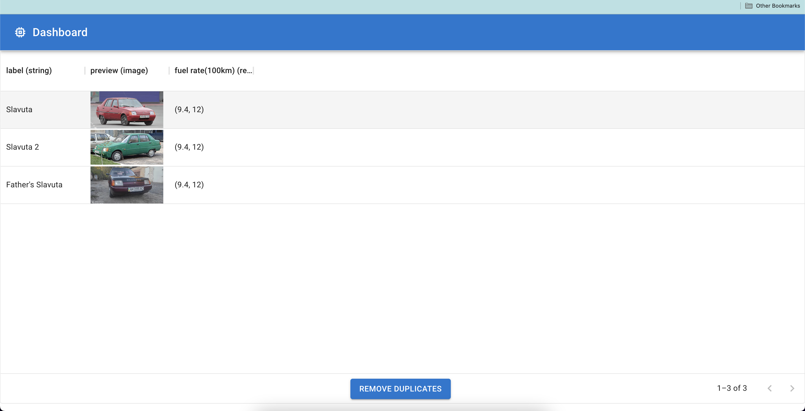

# Deployment

[Heroku](https://dashboard.heroku.com/apps) handles github push webhook, recognize runtime platform and redeploy project.
Frontend and daemon divided to 2 repo's to provide defined behavior for Heroku deployments.

- [Frontend](https://frogdb-frontend.herokuapp.com/dashboard)
- [Backend](https://frogdb.herokuapp.com/docs)

Preview backend:


# Frontend

Just `React` with code-generated REST client. Tool for generation `openapitools/openapi-generator-cli`

Regenerate client:

```bash
make frontend-sdk-gen
```

Preview frontend:

- Dashboard
  
- Create table
  
- Select
  
