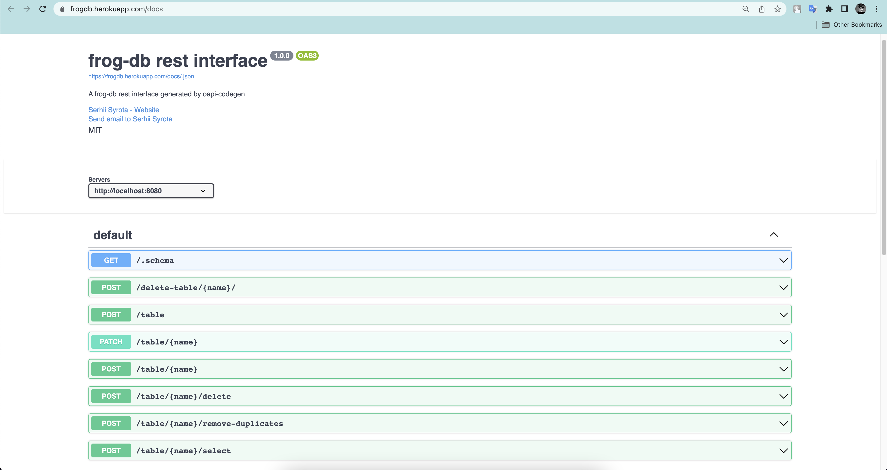

## OpenAPI specification

Machine-readable OpenAPI spec is hosted on `/docs/.json`, derived from [this](../src/web/server/.openapi.yaml) `.yaml` file.

Human-readable interactive documentation based on this spec is hosted on `/docs`

Writing an OpenAPI spec has a number of advantages:

- Code generation
- Tooling for documentation, tests and mocks
- Machine-readability
- Stability

# `frog-db` REST API

Rest server is generated by `https://github.com/getkin/kin-openapi` - support swagger docs creating and `https://github.com/deepmap/oapi-codegen` - server code generation library.

`frog-db` has an option to spin up a REST service. To use it, simply pass a `--rest <port>` flag when starting up `frogdb`.

Advantages of having a REST API:

- Flexible
- Scalable
- Cacheable
- Every call is a simple HTTP request

You can view `frogdb`'s REST server implementation [here](../src/web/web.go).

Swagger page preview:

